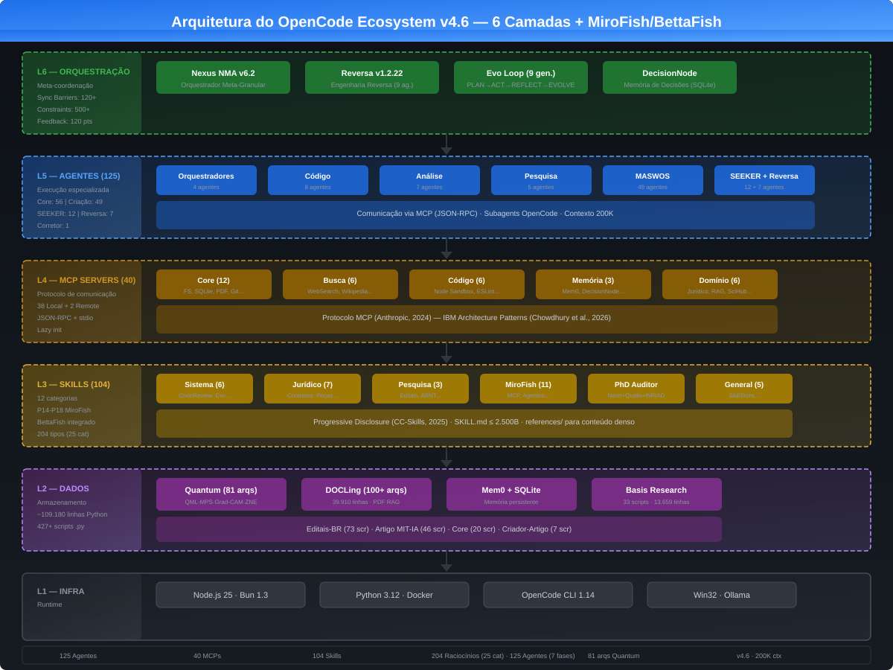

<div align="center">
  
  
  <h1>OpenCode Ecosystem v5.1</h1>
  <p><strong>A Primeira Agência de Inteligência Artificial Autônoma Operando no Seu PC</strong></p>
</div>

---

## 🌍 O que é o OpenCode Ecosystem? (Visão Geral)

Imagine ter uma empresa inteira de tecnologia, um laboratório de pesquisa e uma banca de cientistas — tudo rodando **localmente, de forma autônoma e gratuita** na sua máquina. 

O **OpenCode Ecosystem** é uma arquitetura revolucionária de Inteligência Artificial Multiagente. Ele não é apenas um "assistente de código", mas um **Hub Operacional Autônomo**. Quando você fornece uma missão (seja criar um aplicativo do zero, cruzar dados financeiros ou escrever um artigo científico de nível Doutorado), o sistema desperta **125 agentes virtuais especialistas**. Eles dividem o trabalho, debatem soluções para evitar erros, programam, auditam a segurança e entregam o resultado pronto e revisado.

---

## 🚀 Para Startups e Investidores (O Valor do Negócio)

- **Execução Híbrida e Inteligente:** O ecossistema é flexível e opera tanto de forma local offline (via **Ollama CLI** com modelos como `opencode/qwen-coder-pro`) quanto integrada com a nuvem (via **Xiaomi MiMo API** com contexto gigante de até 1M de tokens para tarefas longas), extinguindo ou minimizando custos com infraestrutura.
- **Produtividade Exponencial:** O pipeline *AutoEvolve* substitui o fluxo de trabalho de semanas por minutos. Tarefas de planejamento de produto, extração de métricas de mercado (50 indicadores globais) e codificação acontecem em paralelo.
- **Escalabilidade Plug & Play:** Arquitetura agnóstica baseada no novo padrão da indústria (Model Context Protocol). A sua empresa pode injetar "Skills" corporativas proprietárias no cérebro do ecossistema instantaneamente.
- **Governança Preventiva Contra Goal Drift:** O ecossistema implementa a tecnologia de **Preventive Cognitive Guardrails (Barreiras Cognitivas Preventivas)** baseada no *SPEC-038 TrustEngine*. Cada decisão tomada pelos agentes de IA passa por um conselho de auditores de confiança em tempo real, mitigando e eliminando alucinações cognitivas e desvios de objetivos em produção.

---

## ⚙️ Para o Público Técnico (Sob o Capô)

A versão **v5.1** eleva o teto da automação de software operando através de WSL2, Windows e Containers de forma transparente:

- 🧠 **Orquestração Nexus (NMA v6.2):** Framework de sincronização meta-granular responsável por coordenar operações atômicas entre agentes usando 120+ barreiras de concorrência.
- 🤖 **125 Agentes Catalogados & 106 Skills Ativas:** Especialistas dinâmicos geridos via um robusto Container de Injeção de Dependências (DI) transversal.
- 🔌 **Camada Universal de Protocolos (41 Servidores MCP):** Integração *out-of-the-box* com bancos SQLite, Web Crawlers, APIs financeiras, Execução de Código Sandbox (Node/Python) e pontes integradas para o **Antigravity CLI (agy)**.
- 🔬 **Módulo de Pesquisa e IA Avançada:** Integração nativa de Computação Quântica simulada (81 arquiteturas testadas) e DataOrchestrator com RAG Multi-Engine Adaptativo.
- 🧬 **Metacognição Funcional e Auditoria:** Sistema de auto-observação (N0 a N3.5) que se autodiagnostica, propõe patches e executa correções em tempo de execução. Todo o modelo teórico, provas matemáticas de complexidade (Set Cover) e mitigação de auto-referência estão compilados no **Manuscrito de Dissertação de 96 páginas** do projeto.

Para o aprofundamento arquitetural e mapeamento vetorial dos processos, consulte a bíblia do sistema:
👉 **[Documentação Técnica Completa (OPENCODE_ECOSYSTEM.md)](OPENCODE_ECOSYSTEM.md)**
👉 **[Manuscrito de Dissertação Acadêmica (DISSERTACAO_OPENCODE_ECOSYSTEM.pdf)](docs/DISSERTACAO_OPENCODE_ECOSYSTEM.pdf)**

---

## 🛠️ Como Iniciar a Agência no seu Windows / WSL2

O ecossistema foi projetado para autogestão inteligente. Você só precisa acordar o orquestrador.

**1. Requisitos Iniciais**
- Ambiente Windows rodando WSL2 (Ubuntu).

**2. Acordando o Sistema**
Abra seu PowerShell como Administrador na pasta raiz e invoque a inicialização:
```powershell
.\start_ecosystem.ps1
```
*(O script se encarrega de levantar os serviços de Inteligência Artificial locais, pontes de proxy e os serviços de container no Linux de forma invisível).*

**3. Auditoria e Validação (Test-Driven)**
Se desejar verificar o pulso dos agentes e atestar que as ferramentas de infraestrutura (MCPs) estão se comunicando sem atritos, dispare a suíte de testes no terminal do WSL:
```bash
./tests/test_environment.sh
```

---

## 🎪 Guia de Demonstração para Eventos de Startups (Pitch & Demo Guide)

Este guia prático foi desenhado para quem precisa configurar, validar e demonstrar o **OpenCode Ecosystem** em um estande de startup, hackathon ou durante uma apresentação de pitch rápido (demo) em uma máquina limpa em menos de 5 minutos.

### 1. Clonagem e Instalação Expressa
Em qualquer terminal conectado à internet, execute a clonagem limpa do repositório:
```bash
# 1. Clonar o projeto do GitHub
git clone https://github.com/MarceloClaro/OpenCode_Ecosystem.git
cd OpenCode_Ecosystem

# 2. Instalar as dependências de pacotes JavaScript
bun install

# 3. Instalar o OpenCode CLI globalmente
npm install -g opencode-ai
```

### 2. Configurando o Modelo (Nuvem ou Offline)
* **Cenário A (Internet Estável)**: Inicie o CLI com `opencode` e conecte-se à nuvem digitando `/connect Xiaomi` para preencher as credenciais de API MiMo (Pay-as-you-go).
* **Cenário B (Internet de Evento Oscilando/Offline - Recomendado)**:
  1. Instale o **Ollama** localmente na máquina de demonstração (através do instalador em [Ollama.com](https://ollama.com)).
  2. Baixe o modelo leve e de alta performance de código em segundo plano:
     ```bash
     ollama pull qwen2.5-coder:7b
     ```
  3. O OpenCode CLI detectará o provedor local configurado no arquivo **[opencode.json](file:///C:/Users/marce/.config/opencode/opencode.json)** e direcionará as interações para a porta local `11434` de forma totalmente offline.

### 3. O Roteiro de Apresentação de Impacto (Os 3 Pilares de "Wow")

Quando um investidor ou jurado de startup visitar seu estande, faça a demonstração focada nestes três diferenciais competitivos de alto valor comercial:

* **Pilar 1: Engenharia de Extremo Rigor (Científico)**
  - *Ação*: Abra o terminal WSL2 na raiz do projeto e execute `./tests/test_environment.sh` mostrando a passagem dos testes.
  - *Narrativa*: *"Nós construímos uma agência com 125 agentes especialistas autônomos cuja integridade de código é verificada por 343 Critical Tests determinísticos em tempo real (100% de aprovação). Não é um protótipo estático; é um sistema industrial autogerido."*
* **Pilar 2: Prevenção de Goal Drift e Hallucinations (Segurança)**
  - *Ação*: Apresente a arquitetura do **SPEC-038 TrustEngine** interceptando comandos lógicos.
  - *Narrativa*: *"Agentes de IA clássicos alucinam e desviam de objetivos, gerando prejuízos. O OpenCode possui barreiras preventivas de comportamento (Preventive Cognitive Guardrails). O TrustEngine intercepta as ações dos agentes em menos de 15ms e bloqueia a execução física de qualquer comando instável."*
* **Pilar 3: Visão de Negócio SaaS (Monetização)**
  - *Ação*: Abra o manuscrito da dissertação em **[DISSERTACAO_OPENCODE_ECOSYSTEM.pdf](file:///C:/Users/marce/Documents/OpenCode_Ecosystem/docs/DISSERTACAO_OPENCODE_ECOSYSTEM.pdf)** e vá até o **Apêndice J (pág 94)**.
  - *Narrativa*: *"Esta tecnologia de contenção já possui modelo de monetização desenhado. Estamos estruturando o TrustEngine como uma API SaaS de nuvem (Trust-as-a-Service - TaaS) cobrada por volume de chamadas, pronta para atuar como middleware de segurança corporativa para qualquer plataforma de IA no mercado."*

### 4. Alinhamento e Unificação do Ecossistema (CLIs & Motores)

Uma das maiores vantagens competitivas do **OpenCode Ecosystem** é a unificação e alinhamento completo entre as diferentes ferramentas de terminal:

* **Ollama CLI (Motor de IA Local):** Roda localmente (na porta `11434`), servindo modelos de código otimizados e leves (como o `qwen2.5-coder:7b` ou `deepseek-r1:7b`).
* **OpenCode CLI (opencode / Interface de Operação):** A interface de linha de comando principal do ecossistema. Ela detecta automaticamente o Ollama local ou a API MiMo de nuvem (configurada em `~/.config/opencode/opencode.json`) e atua como o shell interativo do desenvolvedor.
* **Antigravity CLI (agy / Motor de Agenciamento Avançado):** O motor de orquestração externo fornecido pelo framework do Google DeepMind Advanced Agentic Coding. Ele gerencia execução assíncrona de subagentes paralelos, automação de navegador e criação de artefatos.
* **OpenCode Ecosystem (O Hub de Integração):** O repositório unificado que conecta esses três pilares. Através da **Antigravity Integration Bridge (SPEC-TOP-ANT)** e do plugin `antigravity-bridge.ts`, o ecossistema expõe as ferramentas do Antigravity (busca na web, geração de imagens, automação de browser, subagentes paralelos) para os agentes do OpenCode. Isso permite que o `MasterOrchestrator` de alto nível delegue tarefas complexas para o `AntigravityOrchestrator` de forma fluida.

#### Como demonstrar essa unificação na prática em eventos:
1. **Listagem de Modelos no Ollama**: Mostre que o Ollama está em execução ativa rodando `ollama list` no terminal Linux/WSL.
2. **Inicialização Alinhada no OpenCode CLI**: Inicie o OpenCode CLI rodando `opencode` e envie `/models`. O terminal exibirá instantaneamente os modelos locais servidos pelo Ollama e os modelos remotos de nuvem integrados na mesma interface.
3. **Validação da Ponte (Bridge)**: Execute a suíte de testes (`./tests/test_environment.sh`) para demonstrar como o ecossistema valida autonomamente a integridade e latência de comunicação da ponte de integração `antigravity-mcp` (Bridge).

---

> *"O software tradicional exige que você digite os comandos. O OpenCode Ecosystem inventa as soluções."*
> **Construído com excelência para moldar o futuro da Autonomia Digital.**
