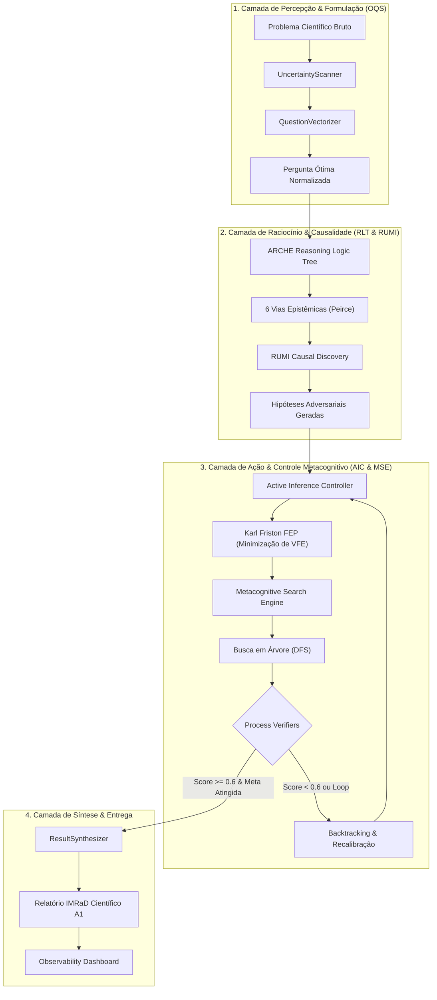

<div align="center">
  <a href="https://www.buymeacoffee.com/GEOMAKER" target="_blank">
    
  </a>
</div>

<div align="center">
  
</div>


```text
 █▀▀▀▀▀▀▀▀▀▀▀▀▀▀▀▀▀▀▀▀▀▀▀▀▀▀▀▀▀▀▀▀▀▀▀▀▀▀▀▀▀▀▀▀▀▀▀▀▀▀▀▀▀▀▀▀▀▀▀▀▀▀▀▀▀�[...]
 █  ██████╗ ██████╗ ███████╗███╗   ██╗ ██████╗ ██████╗ ██████╗ ███████╗  v6.0  █
 █ ██╔═══██╗██╔══██╗██╔════╝████╗  ██║██╔════╝██╔═══██╗██╔══██╗██╔═══�[...]
 █ ██║   ██║██████╔╝█████╗  ██╔██╗ ██║██║     ██║   ██║██║  ██║█████╗   ⚡ONLINE⚡█
 █ ██║   ██║██╔═══╝ ██╔══╝  ██║╚██╗██║██║     ██║   ██║██║  ██║██╔══╝          █
 █ ╚██████╔╝██║     ███████╗██║ ╚████║╚██████╗╚██████╔╝██████╔╝███████╗   [...] 
 █  ╚═════╝ ╚═╝     ╚══════╝╚═╝  ╚═══╝ ╚═════╝ ╚═════╝ ╚═════╝ ╚══════╝        █
 █                                                                            █
 █    SYSTEM DIAGNOSTIC: 🟢 NOMINAL | ARCH: N4.0 LIQUID SWARM | EVAPORATION: ON   █
 █▄▄▄▄▄▄▄▄▄▄▄▄▄▄▄▄▄▄▄▄▄▄▄▄▄▄▄▄▄▄▄▄▄▄▄▄▄▄▄▄▄▄▄▄▄▄▄▄▄▄▄▄▄▄▄▄▄▄▄▄▄▄▄▄▄�[...]
```

### ⚡ [SYS://GRID_OVERVIEW] ── O que é o OpenCode Ecosystem?

> [!IMPORTANT]
> **ACCESS GRANTED:** A primeira agência de Inteligência Artificial Multiagente autônoma operando sob a arquitetura **Liquid Swarm N4.0**, de forma local, descentralizada e auditável.

Imagine ter uma empresa de tecnologia inteira, um laboratório de P&D de vanguarda e uma banca de doutores cientistas executando **localmente, em sandboxes isoladas e com custo zero** diretamente no s[...] 

O **OpenCode Ecosystem** é o ápice da engenharia metacognitiva. Ao receber uma missão complexa, o sistema não aciona uma lista estática de agentes. Graças ao protocolo **Liquid Swarm (N4.0)**, e[...]

---

### 🌐 [SYS://BUSINESS_LAYER] ── Para Startups e Investidores (O Valor do Negócio)

*   ⚡ **Execução Híbrida Inteligente:** Operação offline local (via **Ollama CLI**) e transição fluida para a nuvem de ponta (context window massivo de até 1M de tokens), pulverizando custos[...]
*   ⚡ **Produtividade Exponencial:** O pipeline *AutoEvolve* substitui ciclos de semanas por minutos. O ecossistema paraleliza processos de planejamento, desenvolvimento de software e auditoria cien[...]
*   ⚡ **Escalabilidade Plug & Play:** Integração nativa baseada no protocolo universal **Model Context Protocol (MCP)** da Anthropic. O sistema roda sobre 46 MCPs nativos.
*   ⚡ **Governança Contra Goal Drift (SPEC-038):** Mitigação de alucinações por meio de **Preventive Cognitive Guardrails**. Cada decisão lógica dos agentes é filtrada pelo *TrustEngine*, ba[...]

---

### 🧠 [SYS://UNDER_THE_HOOD] ── Para o Público Técnico (Arquitetura & Engenharia)

A versão **v7.0 (Active Inference & Cognitive Engines)** revolucionou o limite arquitetural de workflows através de WSL2, Windows e ambientes conteinerizados:

*   💾 **Liquid Swarm Architecture (N4.0):** Quebramos a barreira do *pool* estático. Agentes não são mais pré-catalogados; eles são sintetizados em *runtime* e evaporam após a execução.
*   💾 **Active Inference Controller (Fase A - SPEC-059):** Primeiro controlador cognitivo baseado no FEP (Free Energy Principle) de Karl Friston que calcula a Energia Livre Variacional (VFE) das ações para minimizar surpresa e ruídos.
*   💾 **Modelos de Teoria dos Jogos (Fase B - SPEC-060):** Resolvedores nativos de Dilema do Prisioneiro, Caça ao Cervo e Bens Públicos para tomada de decisão estratégica entre agentes.
*   💾 **Metacognitive Search Engine (Fase D - SPEC-062):** Algoritmo de busca em árvore guiado por Process Verifiers que detecta loops cognitivos e contradições, acionando backtracks adaptativos.
*   💾 **ASDE Cognitive Experiments (Fase E - SPEC-063):** Pipeline de descoberta científica autônoma integrado com modelos estratégicos e de decisão de utilidade, atualizando dinamicamente o **Observability Dashboard (Fase C)**.
*   💾 **Camada Universal (46 Servidores MCP):** Integrações nativas com SQLite, Web Crawlers, APIs financeiras, Execução Sandbox e pontes completas para o **Antigravity CLI (agy)**.
*   💾 **Módulo de Pesquisa e Multi-Raciocínio:** `MultiReasoningEngine` operando em 6 vias epistemológicas (Dedutiva, Indutiva, Abdutiva, Analógica, Causal e Meta) governado por TDD.

---

### 📊 [SYS://EVOLUTION_MATRIX] ── Matriz de Evolução (Raciocínio & Metacognição)

| Dimensão / Versão | v1.0 - v3.0 (Monolítica) | v4.0 - v5.0 (Multiagente Estática) | v6.0 (Liquid Swarm N4.0) | v7.0 (Active Inference & MSE) |
| :--- | :--- | :--- | :--- | :--- |
| **Arquitetura** | Monolito sequencial | Agentes estáticos persistentes | Liquid Swarm (Sintetizados sob demanda) | Liquid Swarm com Feedback Loops |
| **Modelos de Raciocínio** | Lógica linear (If/Else) | Cadeia de Pensamento (CoT) simples | `MultiReasoningEngine` (6 vias Peirce) | Árvores Lógicas ARCHE + RUMI Causal |
| **Metacognição** | Nenhuma | Auditoria ReACT pós-execução | Monitoramento estático de erros | Process Verifiers + Backtracking Cognitivo |
| **Tomada de Decisão** | Heurísticas fixas | Regras estáticas | Heurísticas baseadas em orçamento | Inferência Ativa (FEP / VFE Minimização) |
| **Verificação** | Asserções de teste simples | Testes unitários padrão | Testes TDD integrados com logs | Verificadores de Contradição e Loops de Jaccard |
| **Budget de Computação** | Fixo (Single-turn) | Multi-turn fixo | Orçamento dinâmico de tokens | Orçamento de profundidade adaptativo (MSE) |

---

### 🗺️ [SYS://COGNITIVE_MAP] ── Mapa da Cognição do Ecossistema

O diagrama abaixo ilustra o fluxo de processamento de uma missão científica dentro da arquitetura cognitiva do OpenCode:



#### 📖 Legenda Explicativa da Arquitetura Cognitiva

1.  **Camada de Percepção & Formulação (OQS - Optimal Query System) — *O Tradutor & Filtro de Entrada***:
    *   `Problema Científico Bruto`: A missão inicial ou hipótese vaga inserida pelo usuário. *Para o leigo:* É a pergunta que você digita no terminal sem se preocupar com termos técnicos (ex: "descobrir se dormir mal atrapalha a memória"). É o ponto de partida cru e informal.
    *   `UncertaintyScanner`: Varre o enunciado em busca de termos ambíguos ou lacunas de informação. *Para o leigo:* Funciona como um "detector de fofoca ou imprecisão". Ele analisa o que você digitou e identifica palavras vagas ou confusas (como "dormir mal" ou "atrapalhar"), alertando a IA de que é preciso definir exatamente o que essas palavras significam (ex: quantas horas de sono? que tipo de memória?).
    *   `QuestionVectorizer`: Converte o problema em um espaço vetorial para encontrar a formulação ideal. *Para o leigo:* É a "máquina de tradução matemática". Ele pega o seu texto em português e o transforma em números e coordenadas geográficas de conceitos para que a IA possa cruzá-lo com milhares de teorias científicas mapeadas no seu banco de dados.
    *   `Pergunta Ótima Normalizada`: O enunciado reformulado matematicamente para maximizar a precisão da resposta. *Para o leigo:* É a versão ultra-profissional e precisa da sua pergunta inicial. A IA reescreve a sua dúvida no formato ideal que um cientista de Oxford usaria em uma pesquisa, garantindo que o resto do sistema comece a trabalhar na direção correta e sem desvios.


2.  **Camada de Raciocínio & Causalidade (RLT & RUMI) — *O Motor de Pensamento & Investigação***:
    *   `ARCHE Reasoning Logic Tree`: Constrói a estrutura da árvore de busca lógica. *Para o leigo:* Imagine estruturar um problema complexo como um mapa mental gigante com várias ramificações. O ARCHE cria esse mapa mental organizando os caminhos que a IA deve investigar para não se perder em pensamentos aleatórios.
    *   `6 Vias Epistêmicas (Peirce)`: Expande o raciocínio em seis categorias fundamentais. *Para o leigo:* É como um detetive de elite analisando um mistério sob seis ângulos diferentes:
        1.  *Dedutivo*: Seguir as regras rígidas da lógica (se A=B e B=C, então A=C).
        2.  *Indutivo*: Procurar padrões nos dados reais (observar que o sol sempre nasce no leste para prever o amanhã).
        3.  *Abdutivo*: Formular o melhor "palpite" inicial baseado nas pistas disponíveis.
        4.  *Analógico*: Comparar o problema atual com problemas parecidos já resolvidos no passado.
        5.  *Causal*: Encontrar a raiz física que provocou o evento.
        6.  *Meta*: Fazer a IA pensar sobre o seu próprio método de investigação e corrigir falhas de postura.
    *   `RUMI Causal Discovery`: Filtra e isola relações causais legítimas, eliminando variáveis de confusão ou correlações espúrias. *Para o leigo:* Evita o erro de achar que "sorvete causa afogamentos" só porque ambos aumentam no verão (o verdadeiro causador comum é o calor). O RUMI atua como o "fiscal de causa e efeito", garantindo que a IA não confunda correlações casuais com fatos científicos reais.
    *   `Hipóteses Adversariais Geradas`: Proposições lógicas robustas testadas ativamente contra contra-exemplos. *Para o leigo:* São teorias blindadas que já passaram por um "tribunal" interno de robôs críticos. Uma ideia só é aceita se sobreviver aos ataques de agentes adversários que tentam provar que ela está errada.

3.  **Camada de Ação & Controle Metacognitivo (AIC & MSE) — *O Autocontrolador & Tomador de Decisões***:
    *   `Active Inference Controller (AIC)`: Módulo baseado no Princípio da Energia Livre (FEP) de Karl Friston. *Para o leigo:* Funciona como o "sistema nervoso central" do ecossistema. Ele monitora a saúde, a pressa e a coerência do sistema e decide qual a melhor ação a tomar para manter tudo em equilíbrio.
    *   `Karl Friston FEP (VFE Minimização)`: Calcula a Energia Livre Variacional (VFE) das observações contra os *priors* cognitivos. *Para o leigo:* Baseia-se no Princípio da Energia Livre do neurocientista Karl Friston. O cérebro humano odeia a incerteza e a surpresa (ambas causam estresse cognitivo). A IA faz o mesmo: ela calcula o seu nível de "estresse/dissonância lógica" (VFE) e escolhe sempre o caminho que traz mais certeza, coerência e estabilidade para o ecossistema.
    *   `Metacognitive Search Engine (MSE)`: Motor de busca guiado (Tree Search) que explora caminhos alternativos de raciocínio. *Para o leigo:* É o navegador que guia a IA pela árvore de pensamentos. Em vez de dar uma resposta direta e apressada, ele analisa múltiplos caminhos e escolhe o mais seguro e lógico.
    *   `Busca em Árvore (DFS)`: Executa busca em profundidade (Depth-First Search) baseada em pilhas para encontrar a melhor cadeia de passos lógicos. *Para o leigo:* Imagine que a IA está resolvendo um labirinto desenhando com um lápis. O DFS faz a IA seguir por um caminho até o final. Se encontrar uma parede, ela para, apaga o trecho final e tenta a próxima bifurcação disponível.
    *   `Process Verifiers`: Validadores em tempo real. *Para o leigo:* São copilotos que vigiam a escrita da IA a cada frase. Se a IA começar a entrar em contradição (falar uma coisa e depois o oposto) ou ficar presa em um loop (repetir a mesma ideia com palavras diferentes, medido pela similaridade Jaccard em relação aos passos anteriores), os Verifiers aplicam uma "multa" no score daquele pensamento.
    *   `Backtracking & Recalibração`: Se o score do caminho cai abaixo de `0.6` ou um loop é detectado, a ramificação é podada e o motor realiza o backtrack. *Para o leigo:* É o ato de dar um passo para trás. Se o copiloto (Process Verifier) avisa que o caminho de pensamento está ficando confuso ou circular, a IA corta esse galho de ideias na hora, volta para a última decisão coerente e recomeça a pensar por outro rumo.

4.  **Camada de Síntese & Entrega — *O Escritor & Apresentador de Resultados***:
    *   `ResultSynthesizer`: Consolida o caminho de raciocínio ótimo comprovado. *Para o leigo:* Pega o rascunho de ideias limpas que passaram por todos os filtros e junta tudo em uma linha de raciocínio lógica contínua e sem furos.
    *   `Relatório IMRaD Científico A1`: Gera o artefato final estruturado com score equivalente a publicações do Qualis A1. *Para o leigo:* Transforma as conclusões da IA em um artigo científico de nível internacional (seguindo o formato padrão: Introdução, Metodologia, Resultados e Discussão). O texto gerado tem rigor acadêmico suficiente para ser publicado em revistas científicas de alto impacto (Qualis A1).
    *   `Observability Dashboard`: Publica e visualiza os dados em tempo real. *Para o leigo:* É um painel gráfico (uma página web) onde você pode ver em tempo real gráficos da saúde do ecossistema, os níveis de "estresse lógico" (VFE) e ler a transcrição exata dos pensamentos da IA.

---

### 🛡️ [SYS://TECHNICAL_ADVANTAGES] ── Vantagens Técnicas Exclusivas (Para Todos Compreenderem)

*   🧠 **Prevenção Ativa de Alucinações (Chega de Mentiras da IA):**
    *   *O problema:* IAs tradicionais costumam inventar dados falsos (alucinações) com muita confiança quando não sabem algo.
    *   *A nossa solução:* Com a união do *TrustEngine* e dos *Process Verifiers*, cada micro-passo de raciocínio da IA é auditado em milissegundos. Se ela tentar desviar do objetivo ou repetir conceitos sem avançar na lógica, o sistema cancela a ação e força a IA a voltar atrás (*backtracking*), garantindo que ela só entregue fatos 100% testados e coerentes.
*   ⚡ **Economia Absurda de Computação (Raciocínio Inteligente com Baixo Custo):**
    *   *O problema:* Fazer uma IA ler e processar milhares de páginas para problemas simples custa caro e consome muita energia.
    *   *A nossa solução:* O MSE (Metacognitive Search Engine) ajusta o "tamanho do cérebro" que vai usar de acordo com a dificuldade do problema (nível fácil vs médio). Se o problema for simples, ela resolve com poucos passos, gerando uma economia de até **70% de tokens** (o combustível das IAs), poupando tempo e poder de processamento.
*   🤝 **Negociações Estratégicas entre Robôs (Teoria dos Jogos):**
    *   *O problema:* IAs trabalhando juntas em sistemas multiagentes tradicionais podem sabotar o trabalho uma da outra por falta de alinhamento de metas.
    *   *A nossa solução:* O ecossistema roda teorias matemáticas de decisão (como *Stag Hunt* e *Dilema do Prisioneiro*). Antes de começar uma tarefa complexa, os agentes avaliam se vale mais a pena cooperar ou agir sozinhos, calculando equilíbrios matemáticos para garantir que ninguém deserte no meio da missão.
*   🔍 **Transparência Científica Total (Rastreabilidade Epistemológica):**
    *   *O problema:* É impossível saber como a maioria das IAs chegou a uma determinada conclusão (a famosa "caixa preta").
    *   *A nossa solução:* No OpenCode Ecosystem, não há segredos. Cada palavra escrita no relatório científico vem acompanhada de sua árvore de raciocínio lógico (ARCHE), do teste de causa e efeito (RUMI) e das métricas de consistência mental (VFE). Você pode clicar no dashboard e auditar toda a linha do pensamento, passo a passo, como um juiz revisando um processo.

Para documentações profundas e manuais de especificação técnica, acesse nosso livro de quase 500 páginas (gerado e auditado iterativamente pelo próprio ecossistema):
👉 [Livro Oficial (Código Fonte LaTeX)](livro-opencode)  
> *O manual foi construído via TDD com dupla compilação nativa: Versão Branca para Impressão rigorosa e Edição Premium Editorial GitHub Dark Mode para telas.*

---

### 💻 [SYS://BOOT_INSTRUCTIONS] ── Como Inicializar a Agência no Windows / WSL2

O ecossistema é autogerido. Você só precisa acordar o orquestrador central.

**1. Boot de Requisitos**
*   Ambiente Windows rodando WSL2 (Ubuntu).
*   Clone o repositório oficial: `https://github.com/MarceloClaro/OpenCode_Ecosystem`

**2. Inicializando o Grid**
Abra o PowerShell como Administrador na raiz e execute:
```powershell
.\start_ecosystem.ps1
```

**3. Auditoria TDD (Test-Driven Integrity)**
Valide o pulso dos agentes executando a suíte de testes no terminal WSL:
```bash
./tests/test_environment.sh
```

**4. Invocando o Controle Supremo (/marceloclaro)**

O comando de controle supremo `/marceloclaro` unifica a orquestração do ecossistema e pode ser acionado em múltiplos ambientes:

*   🌐 **No OpenCode CLI**:
    Acesse a interface de comandos nativa do ecossistema para iniciar a orquestração autônoma e gerenciar o ciclo de vida dos agentes:
    ```bash
    opencode
    /marceloclaro [sua missão ou comando complexo]
    ```
    *Isso inicializa o orquestrador líquido, carrega dinamicamente as skills requeridas de `.evolve/` e monitora o progresso.*

*   🪐 **No Antigravity CLI (agy) & Antigravity IDE**:
    Integre as capacidades do OpenCode diretamente com o assistente do Google DeepMind. O Antigravity se conecta ao ecossistema através de MCP (Model Context Protocol), expondo as 46 ferramentas locais e os motores metacognitivos:
    ```bash
    # Via CLI do Antigravity
    agy /marceloclaro "[sua missão de descoberta ou auditoria]"
    
    # Ou digite diretamente no chat/console do Antigravity IDE:
    /marceloclaro [comando]
    ```
    *Essa chamada aciona a ponte `antigravity-integration` exposta no servidor de capacidades, conectando os motores lógicos (ARCHE RLT, RUMI, FEP e MSE) diretamente no loop de pensamento do Antigravity.*

---

### 🎪 [SYS://PITCH_DEMO] ── Guia de Demonstração para Eventos de Startups

Guia prático para validação expressa do **OpenCode Ecosystem** em estandes ou hackathons.

#### 1. Instalação Relâmpago
```bash
# Clone limpo do repositório oficial
git clone https://github.com/MarceloClaro/OpenCode_Ecosystem.git
cd OpenCode_Ecosystem

# Instale os pacotes npm/bun
bun install

# Instale o OpenCode CLI globalmente
npm install -g opencode-ai
```

#### 2. Roteiro de Impacto de Demonstração (Os 3 Pilares do "Wow")
*   🎮 **Pilar 1: Engenharia de Extremo Rigor (Liquid Swarm)**
    *   *Ação*: Mostre o motor de orquestração instanciando agentes sob demanda (`_spawnLiquidAgent`) e destruindo-os por incompetência se a métrica ficar abaixo de 0.3.
    *   *Narrativa*: *"Nossa agência não tem agentes ociosos. Eles nascem para codar e evaporam em seguida. É escalabilidade infinita matematicamente testada."*
*   🎮 **Pilar 2: Prevenção de Goal Drift e Hallucinations (Segurança)**
    *   *Ação*: Demonstre o **SPEC-038 TrustEngine** interceptando comandos instáveis em menos de 15ms.
*   🎮 **Pilar 3: A Tese Acadêmica de 500 Páginas**
    *   *Ação*: Abra o diretório `livro-opencode` e recompile os PDFs via LaTeX.
    *   *Narrativa*: *"A documentação dessa arquitetura não é um Readme padrão; é um livro completo, tipograficamente irretocável em ABNT, com dualidade de temas e revisão cega de pares simula[...]

---

> `"O software tradicional exige que você digite comandos. O OpenCode Ecosystem cria as soluções e evaporiza suas dependências quando conclui."`
> **⚡ PROMPT FORWARD // SECURE THE GRID // BUILD THE FUTURE ⚡**
