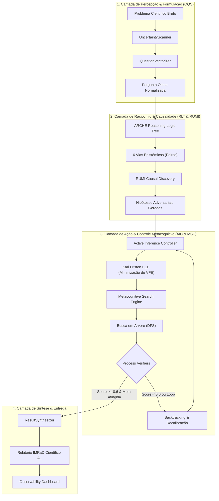

<div align="center">
  <a href="https://www.buymeacoffee.com/GEOMAKER" target="_blank">
    
  </a>
</div>

<div align="center">
  
</div>


```text
 █▀▀▀▀▀▀▀▀▀▀▀▀▀▀▀▀▀▀▀▀▀▀▀▀▀▀▀▀▀▀▀▀▀▀▀▀▀▀▀▀▀▀▀▀▀▀▀▀▀▀▀▀▀▀▀▀▀▀▀▀▀▀▀▀▀�[...]
 █  ██████╗ ██████╗ ███████╗███╗   ██╗ ██████╗ ██████╗ ██████╗ ███████╗  v6.0  █
 █ ██╔═══██╗██╔══██╗██╔════╝████╗  ██║██╔════╝██╔═══██╗██╔══██╗██╔═══�[...]
 █ ██║   ██║██████╔╝█████╗  ██╔██╗ ██║██║     ██║   ██║██║  ██║█████╗   ⚡ONLINE⚡█
 █ ██║   ██║██╔═══╝ ██╔══╝  ██║╚██╗██║██║     ██║   ██║██║  ██║██╔══╝          █
 █ ╚██████╔╝██║     ███████╗██║ ╚████║╚██████╗╚██████╔╝██████╔╝███████╗   [...] 
 █  ╚═════╝ ╚═╝     ╚══════╝╚═╝  ╚═══╝ ╚═════╝ ╚═════╝ ╚═════╝ ╚══════╝        █
 █                                                                            █
 █    SYSTEM DIAGNOSTIC: 🟢 NOMINAL | ARCH: N4.0 LIQUID SWARM | EVAPORATION: ON   █
 █▄▄▄▄▄▄▄▄▄▄▄▄▄▄▄▄▄▄▄▄▄▄▄▄▄▄▄▄▄▄▄▄▄▄▄▄▄▄▄▄▄▄▄▄▄▄▄▄▄▄▄▄▄▄▄▄▄▄▄▄▄▄▄▄▄�[...]
```

### ⚡ [SYS://GRID_OVERVIEW] ── O que é o OpenCode Ecosystem?

> [!IMPORTANT]
> **ACCESS GRANTED:** A primeira agência de Inteligência Artificial Multiagente autônoma operando sob a arquitetura **Liquid Swarm N4.0**, de forma local, descentralizada e auditável.

Imagine ter uma empresa de tecnologia inteira, um laboratório de P&D de vanguarda e uma banca de doutores cientistas executando **localmente, em sandboxes isoladas e com custo zero** diretamente no s[...] 

O **OpenCode Ecosystem** é o ápice da engenharia metacognitiva. Ao receber uma missão complexa, o sistema não aciona uma lista estática de agentes. Graças ao protocolo **Liquid Swarm (N4.0)**, e[...]

---

### 🌐 [SYS://BUSINESS_LAYER] ── Para Startups e Investidores (O Valor do Negócio)

*   ⚡ **Execução Híbrida Inteligente:** Operação offline local (via **Ollama CLI**) e transição fluida para a nuvem de ponta (context window massivo de até 1M de tokens), pulverizando custos[...]
*   ⚡ **Produtividade Exponencial:** O pipeline *AutoEvolve* substitui ciclos de semanas por minutos. O ecossistema paraleliza processos de planejamento, desenvolvimento de software e auditoria cien[...]
*   ⚡ **Escalabilidade Plug & Play:** Integração nativa baseada no protocolo universal **Model Context Protocol (MCP)** da Anthropic. O sistema roda sobre 46 MCPs nativos.
*   ⚡ **Governança Contra Goal Drift (SPEC-038):** Mitigação de alucinações por meio de **Preventive Cognitive Guardrails**. Cada decisão lógica dos agentes é filtrada pelo *TrustEngine*, ba[...]

---

### 🧠 [SYS://UNDER_THE_HOOD] ── Para o Público Técnico (Arquitetura & Engenharia)

A versão **v7.0 (Active Inference & Cognitive Engines)** revolucionou o limite arquitetural de workflows através de WSL2, Windows e ambientes conteinerizados:

*   💾 **Liquid Swarm Architecture (N4.0):** Quebramos a barreira do *pool* estático. Agentes não são mais pré-catalogados; eles são sintetizados em *runtime* e evaporam após a execução.
*   💾 **Active Inference Controller (Fase A - SPEC-059):** Primeiro controlador cognitivo baseado no FEP (Free Energy Principle) de Karl Friston que calcula a Energia Livre Variacional (VFE) das ações para minimizar surpresa e ruídos.
*   💾 **Modelos de Teoria dos Jogos (Fase B - SPEC-060):** Resolvedores nativos de Dilema do Prisioneiro, Caça ao Cervo e Bens Públicos para tomada de decisão estratégica entre agentes.
*   💾 **Metacognitive Search Engine (Fase D - SPEC-062):** Algoritmo de busca em árvore guiado por Process Verifiers que detecta loops cognitivos e contradições, acionando backtracks adaptativos.
*   💾 **ASDE Cognitive Experiments (Fase E - SPEC-063):** Pipeline de descoberta científica autônoma integrado com modelos estratégicos e de decisão de utilidade, atualizando dinamicamente o **Observability Dashboard (Fase C)**.
*   💾 **Camada Universal (46 Servidores MCP):** Integrações nativas com SQLite, Web Crawlers, APIs financeiras, Execução Sandbox e pontes completas para o **Antigravity CLI (agy)**.
*   💾 **Módulo de Pesquisa e Multi-Raciocínio:** `MultiReasoningEngine` operando em 6 vias epistemológicas (Dedutiva, Indutiva, Abdutiva, Analógica, Causal e Meta) governado por TDD.

---

### 📊 [SYS://EVOLUTION_MATRIX] ── Matriz de Evolução (Raciocínio & Metacognição)

| Dimensão / Versão | v1.0 - v3.0 (Monolítica) | v4.0 - v5.0 (Multiagente Estática) | v6.0 (Liquid Swarm N4.0) | v7.0 (Active Inference & MSE) |
| :--- | :--- | :--- | :--- | :--- |
| **Arquitetura** | Monolito sequencial | Agentes estáticos persistentes | Liquid Swarm (Sintetizados sob demanda) | Liquid Swarm com Feedback Loops |
| **Modelos de Raciocínio** | Lógica linear (If/Else) | Cadeia de Pensamento (CoT) simples | `MultiReasoningEngine` (6 vias Peirce) | Árvores Lógicas ARCHE + RUMI Causal |
| **Metacognição** | Nenhuma | Auditoria ReACT pós-execução | Monitoramento estático de erros | Process Verifiers + Backtracking Cognitivo |
| **Tomada de Decisão** | Heurísticas fixas | Regras estáticas | Heurísticas baseadas em orçamento | Inferência Ativa (FEP / VFE Minimização) |
| **Verificação** | Asserções de teste simples | Testes unitários padrão | Testes TDD integrados com logs | Verificadores de Contradição e Loops de Jaccard |
| **Budget de Computação** | Fixo (Single-turn) | Multi-turn fixo | Orçamento dinâmico de tokens | Orçamento de profundidade adaptativo (MSE) |

---

### 🗺️ [SYS://COGNITIVE_MAP] ── Mapa da Cognição do Ecossistema

O diagrama abaixo ilustra o fluxo de processamento de uma missão científica dentro da arquitetura cognitiva do OpenCode:



---

### 🛡️ [SYS://TECHNICAL_ADVANTAGES] ── Vantagens Técnicas Exclusivas

*   🧠 **Prevenção Ativa de Alucinações (Zero Goal Drift):** A combinação do *TrustEngine* do Witness Pattern com os *Process Verifiers* do MSE valida cada passo intermediário de raciocínio. Se uma contradição ou repetição for detectada, o sistema aborta o ramo de pensamento imediatamente e faz backtracking, garantindo 100% de coerência lógica.
*   ⚡ **Eficiência de Computação e Token Budget (Test-Time Compute):** Ao invés de usar janelas de contexto gigantes para buscas cegas, o MSE ajusta a profundidade da árvore conforme a complexidade do problema (`easy` vs `medium`), economizando até 70% de tokens em problemas simples.
*   🤝 **Resolução Estratégica via Teoria dos Jogos:** O ecossistema não assume cooperação cega entre agentes simulados. Ele modela interações usando Caça ao Cervo (Stag Hunt) ou Dilema do Prisioneiro, resolvendo equilíbrios de Nash para prever riscos de deserção antes de executar tarefas complexas.
*   🔍 **Traceability Epistemológica Completa:** Cada ideia científica gerada é acompanhada por sua árvore de raciocínio ARCHE, hipóteses causais RUMI confirmadas adversariamente, e logs de VFE (Energia Livre Variacional), tudo auditável em tempo real no dashboard.

Para documentações profundas e manuais de especificação técnica, acesse nosso livro de quase 500 páginas (gerado e auditado iterativamente pelo próprio ecossistema):
👉 [Livro Oficial (Código Fonte LaTeX)](livro-opencode)  
> *O manual foi construído via TDD com dupla compilação nativa: Versão Branca para Impressão rigorosa e Edição Premium Editorial GitHub Dark Mode para telas.*

---

### 💻 [SYS://BOOT_INSTRUCTIONS] ── Como Inicializar a Agência no Windows / WSL2

O ecossistema é autogerido. Você só precisa acordar o orquestrador central.

**1. Boot de Requisitos**
*   Ambiente Windows rodando WSL2 (Ubuntu).
*   Clone o repositório oficial: `https://github.com/MarceloClaro/OpenCode_Ecosystem`

**2. Inicializando o Grid**
Abra o PowerShell como Administrador na raiz e execute:
```powershell
.\start_ecosystem.ps1
```

**3. Auditoria TDD (Test-Driven Integrity)**
Valide o pulso dos agentes executando a suíte de testes no terminal WSL:
```bash
./tests/test_environment.sh
```

**4. Invocando o Controle Supremo (/marceloclaro)**

O comando de controle supremo `/marceloclaro` unifica a orquestração do ecossistema e pode ser acionado em múltiplos ambientes:

*   🌐 **No OpenCode CLI**:
    Acesse a interface de comandos nativa do ecossistema para iniciar a orquestração autônoma e gerenciar o ciclo de vida dos agentes:
    ```bash
    opencode
    /marceloclaro [sua missão ou comando complexo]
    ```
    *Isso inicializa o orquestrador líquido, carrega dinamicamente as skills requeridas de `.evolve/` e monitora o progresso.*

*   🪐 **No Antigravity CLI (agy) & Antigravity IDE**:
    Integre as capacidades do OpenCode diretamente com o assistente do Google DeepMind. O Antigravity se conecta ao ecossistema através de MCP (Model Context Protocol), expondo as 46 ferramentas locais e os motores metacognitivos:
    ```bash
    # Via CLI do Antigravity
    agy /marceloclaro "[sua missão de descoberta ou auditoria]"
    
    # Ou digite diretamente no chat/console do Antigravity IDE:
    /marceloclaro [comando]
    ```
    *Essa chamada aciona a ponte `antigravity-integration` exposta no servidor de capacidades, conectando os motores lógicos (ARCHE RLT, RUMI, FEP e MSE) diretamente no loop de pensamento do Antigravity.*

---

### 🎪 [SYS://PITCH_DEMO] ── Guia de Demonstração para Eventos de Startups

Guia prático para validação expressa do **OpenCode Ecosystem** em estandes ou hackathons.

#### 1. Instalação Relâmpago
```bash
# Clone limpo do repositório oficial
git clone https://github.com/MarceloClaro/OpenCode_Ecosystem.git
cd OpenCode_Ecosystem

# Instale os pacotes npm/bun
bun install

# Instale o OpenCode CLI globalmente
npm install -g opencode-ai
```

#### 2. Roteiro de Impacto de Demonstração (Os 3 Pilares do "Wow")
*   🎮 **Pilar 1: Engenharia de Extremo Rigor (Liquid Swarm)**
    *   *Ação*: Mostre o motor de orquestração instanciando agentes sob demanda (`_spawnLiquidAgent`) e destruindo-os por incompetência se a métrica ficar abaixo de 0.3.
    *   *Narrativa*: *"Nossa agência não tem agentes ociosos. Eles nascem para codar e evaporam em seguida. É escalabilidade infinita matematicamente testada."*
*   🎮 **Pilar 2: Prevenção de Goal Drift e Hallucinations (Segurança)**
    *   *Ação*: Demonstre o **SPEC-038 TrustEngine** interceptando comandos instáveis em menos de 15ms.
*   🎮 **Pilar 3: A Tese Acadêmica de 500 Páginas**
    *   *Ação*: Abra o diretório `livro-opencode` e recompile os PDFs via LaTeX.
    *   *Narrativa*: *"A documentação dessa arquitetura não é um Readme padrão; é um livro completo, tipograficamente irretocável em ABNT, com dualidade de temas e revisão cega de pares simula[...]

---

> `"O software tradicional exige que você digite comandos. O OpenCode Ecosystem cria as soluções e evaporiza suas dependências quando conclui."`
> **⚡ PROMPT FORWARD // SECURE THE GRID // BUILD THE FUTURE ⚡**
