# 🏗️ OpenCode Ecosystem — Mapa Arquitetônico Completo

> **Versão:** v7.2.0 | **CTs:** 537 | **Evoluções:** R1→R45 | **Atualização:** 2026-07-04  
> **Graphify:** 7.099 nós · 13.717 arestas · 376 comunidades  
> **FlowZap Interativo:** [Arquitetura Completa](https://flowzap.xyz/playground/4683567e-9809-4132-b774-9c496e86ee40?view=architecture)  
> **Árvore Interativa:** `graphify-out/GRAPH_TREE.html` (536KB)  
> **Call-Flow HTML:** `graphify-out/OpenCode_Ecosystem-callflow.html` (17 seções · 16 diagramas Mermaid)  
> **Grafo JSON:** `graphify-out/graph.json` (para consultas com `graphify query "..."`)

---

## Sumário

1. [Visão Geral — Arquitetura em Camadas L0–L6](#1-visão-geral--arquitetura-em-camadas-l0l6)
2. [Pipeline de Scanners (Evolução R19–R45)](#2-pipeline-de-scanners)
3. [Pipeline Acadêmico (MASWOS + SEEKER + Qualis A1)](#3-pipeline-acadêmico)
4. [MiroFish / BettaFish (P14–P18 + PhD Auditor)](#4-mirofish--bettafish)
5. [Motores de Raciocínio Multi-Paradigma](#5-motores-de-raciocínio-multi-paradigma)
6. [Hierarquia de Agentes (128 Agentes)](#6-hierarquia-de-agentes)
7. [Trust Engine — N3.5 Completo (SPEC-038)](#7-trust-engine)
8. [Token Economy (SPEC-022-024)](#8-token-economy)
9. [Ciclos Evolutivos R1→R45](#9-ciclos-evolutivos)
10. [5 Pilares — Marcelo Claro](#10-os-5-pilares)
11. [Resumo de Componentes](#11-resumo-de-componentes)
12. [Mapa de Fluxo da Informação](#12-mapa-de-fluxo-da-informação)
13. [Descobertas do Graphify](#13-descobertas-do-graphify)

---

## 1. 🌐 Visão Geral — Arquitetura em Camadas L0–L6

**Legenda:** L0 = Infraestrutura (base) → L6 = Interface e comando (topo).  
Cada camada depende dos serviços da camada imediatamente inferior.

```mermaid
%%{init: {"theme": "dark", "themeVariables": {"fontSize": "14px"}}}%%
graph TB
    subgraph L6["L6 - Interface e Comando"]
        CLI["OpenCode CLI / Antigravity CLI"]
        CMDS["Comandos: /evolve /reversa /plan /auto /artigo /quantum"]
        PLUGINS["15 Plugins (npm + .ts + bridge)"]
        MCP_GW["MCP Gateway (46 servidores)"]
    end

    subgraph L5["L5 - Orquestracao e Governanca"]
        MARCELO["/marceloclaro (Orquestrador Supremo)"]
        MASTER["master-orchestrator"]
        STAGE["stage-orchestrator"]
        ANTIGRAVITY["antigravity-orchestrator"]
        TRUST["Trust Engine (SPEC-038)"]
        TOKEN["Token Economy (SPEC-022-024)"]
    end

    subgraph L4["L4 - Auditores e Scanners"]
        PHD_AUDIT["PhD Auditor (Nash + Qualis + Bonferroni)"]
        SCANNERS["Pipeline Scanners (6 modulos)"]
        META["Metacognition (SPEC-036)"]
        SNS["Structural Noise Scanner (SPEC-037)"]
        POTENTIALITY["Potentiality Estimator v2 (SPEC-045)"]
    end

    subgraph L3["L3 - Motores de Raciocinio e Ciencia"]
        REASONING["4 Reasoning Engines"]
        SCIENCE["38 Science Skills"]
        MIROFISH["MiroFish/BettaFish (11 modulos)"]
        GAME_THEORY["10 Jogos Classicoss"]
        QUANTUM["Quantum Nexus (146 arquivos)"]
    end

    subgraph L2["L2 - Agentes Especializados"]
        CORE_AGENTS["56 Agentes Core"]
        CRIADOR["49 Agentes MASWOS"]
        SEEKER["12 SEEKER Agents"]
        REVERSA["18 Reversa Agents"]
        LINGUISTIC["1 Linguistic Corrector"]
    end

    subgraph L1["L1 - Habilidades (Skills)"]
        SKILLS_SYS["12 System Skills"]
        SKILLS_JUR["7 Juridico"]
        SKILLS_RESEARCH["18 Research"]
        SKILLS_SCIENCE["38 Science"]
        SKILLS_REASON["4 Reasoning"]
        SKILLS_OUTROS["149 Outras"]
    end

    subgraph L0["L0 - Infraestrutura"]
        MCP_LOCAL["44 MCPs Locais"]
        MCP_REMOTE["2 MCPs Remotos"]
        LSP["1 LSP (TypeScript)"]
        CORRECTOR["ptbr_corrector.py"]
    end

    L6 --> L5
    L5 --> L4
    L4 --> L3
    L3 --> L2
    L2 --> L1
    L1 --> L0
```

---

## 2. ⚙️ Pipeline de Scanners

**Legenda:** O pipeline encadeia 7 scanners que transformam código/SPECs em roadmaps estratégicos.  
Cada scanner alimenta o seguinte, com análise cruzada no meio.

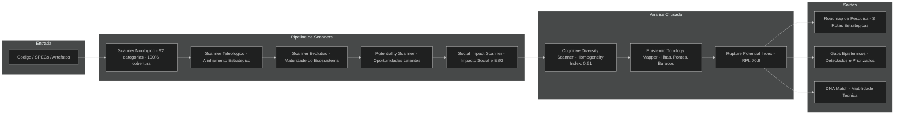

---

## 3. 🧪 Pipeline Acadêmico

**Legenda:** Fluxo completo de produção acadêmica desde a pesquisa até a exportação Qualis A1.  
Cada fase tem validação cruzada e correção iterativa.

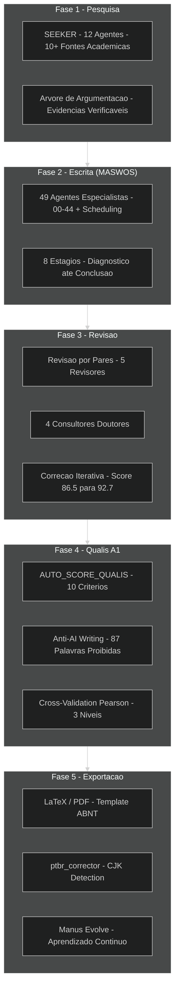

---

## 4. 🧬 MiroFish / BettaFish (P14–P18)

**Legenda:** Componentes do ecossistema de auditoria acadêmica multi-agente.  
P14-P17 alimentam o P18 (PhD Auditor) que produz validação Qualis A1.

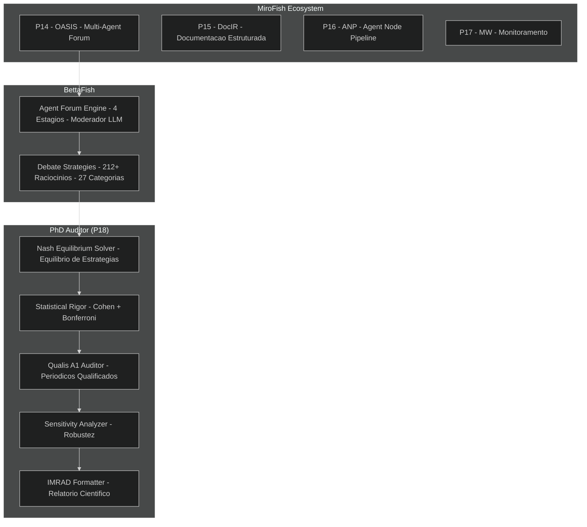

---

## 5. 🧠 Motores de Raciocínio Multi-Paradigma

**Legenda:** 4 motores independentes conectados por bridge cross-paradigma.  
Self-Repair System mantém saúde dos motores com heartbeat e fallback.

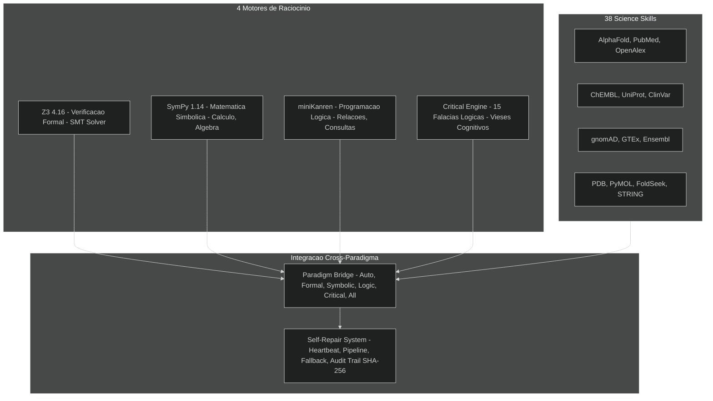

---

## 6. 🧭 Hierarquia de Agentes

**Legenda:** 128 agentes em 4 categorias principais, orquestrados por Marcelo Claro.  
Cada categoria tem especialização vertical.

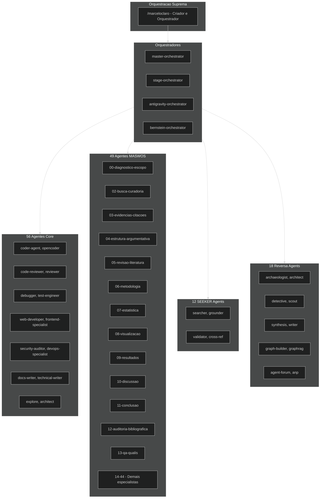

---

## 7. 🤝 Trust Engine (N3.5 Completo — SPEC-038)

**Legenda:** N3.5 = N3 completo (forecasting, introspection, boundary, causal) + gate preventivo.  
O TrustScorer usa blend 70/30 e shadow mode para detecção de desvios em menos de 15ms.

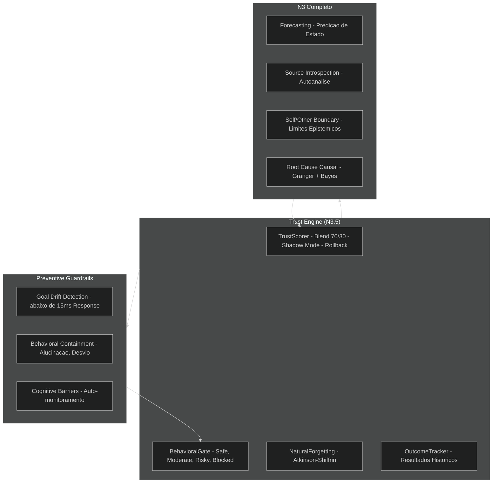

---

## 8. 💰 Token Economy (SPEC-022-024)

**Legenda:** Tripé economia: ledger imutável + fee market dinâmico + auditoria SHA-256.  
Três planos (Bronze/Silver/Gold) com staking 7d e slashing.

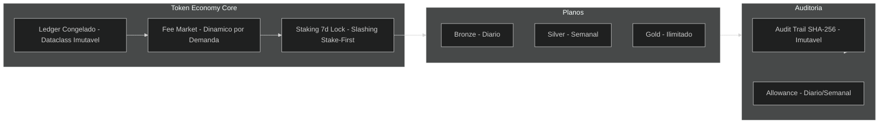

---

## 9. 📈 Ciclos Evolutivos R1→R45

**Legenda:** Score evoluiu de 85 (R1) para 100 (R20-R45).  
Cada ciclo adiciona nova capacidade ao ecossistema.

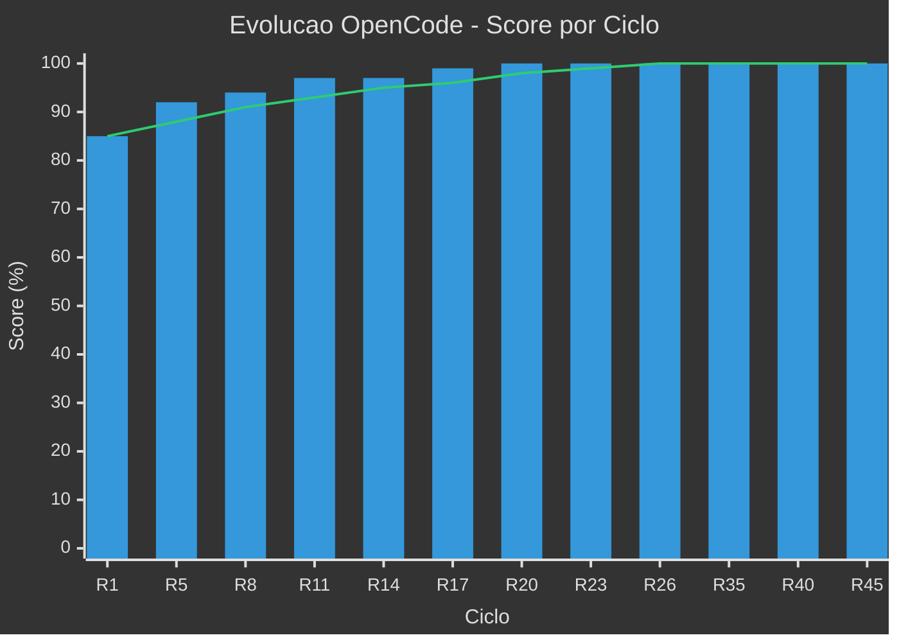

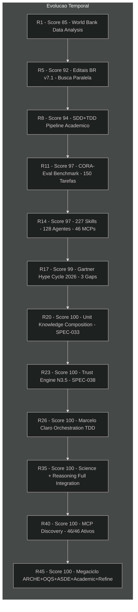

---

## 10. 🎯 Os 5 Pilares

**Legenda:** Cada pilar é um pilar arquitetônico do ecossistema, validado por 537 CTs.

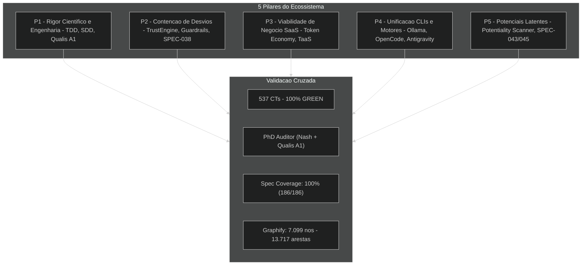

---

## 11. 📊 Resumo de Componentes

**Legenda:** Distribuição dos 600+ componentes integrados no ecossistema.

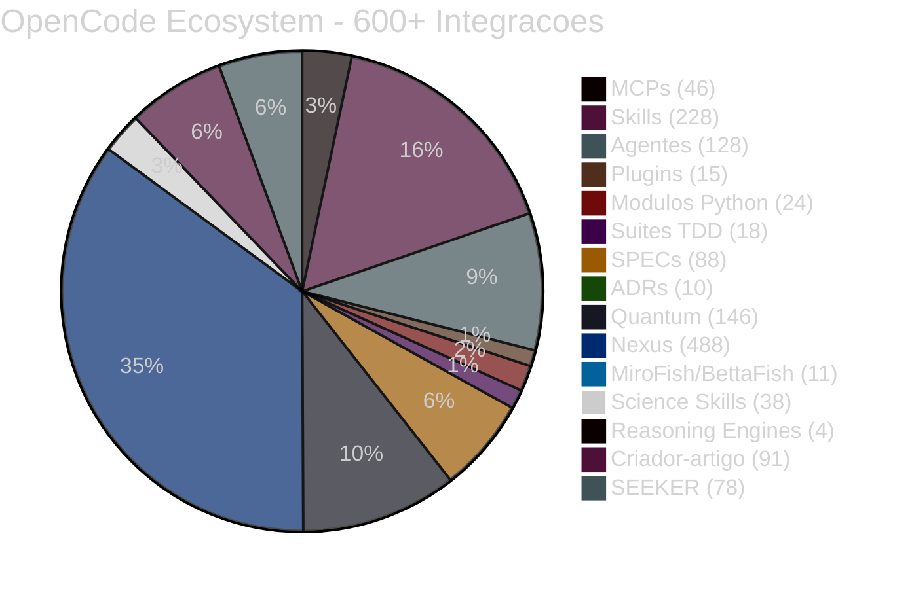

---

## 12. 🔄 Mapa de Fluxo da Informação

**Legenda:** Ciclo completo: entrada → orquestração → pipeline → geração → revisão → saída → evolução.

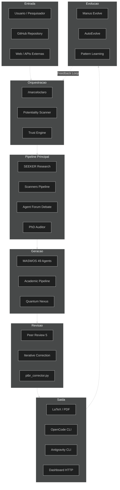

---

## 13. 🔍 Descobertas do Graphify

O Graphify extraiu **7.099 nós** e **13.717 arestas** de 245 arquivos Python, organizados em **376 comunidades**.

### Nós Centrais (God Nodes)

| Nó | Grau | Função |
|----|------|--------|
| `Container` | 98 | DI container singleton |
| `AuditEntry` | 61 | Auditoria SHA-256 |
| `NexusIntegrationFacade` | 57 | Fachada de integração |
| `MCPRouter` | 56 | Roteamento MCP |
| `SocialAlgorithms` | 56 | Algoritmos sociais |
| `initialize_core()` | 55 | Inicialização do core |
| `KnowledgeGraph` | 54 | Grafo de conhecimento |
| `DoclingAdapter` | 51 | Adaptador PDF |
| `GranularSyncManager` | 47 | Barreiras de sincronização |

### Conexões Surpreendentes (Graphify INFERRED)

- `GameTheorySolver` → `PeirceType` (Raciocínio lógico aplicado a jogos)
- `convert_game_to_rlt()` → `RLTNode` (ARCHE integrado à teoria dos jogos)
- `GameTheorySolver` → `RLTNode` (Bridge entre teoria dos jogos e lógica peirceana)
- `TestAutoSwarm` → `AgentSpec` (Testes conectados à especificação de agentes)

### Top 10 Tipos de Arestas

| Tipo | Quantidade | Descrição |
|------|-----------|-----------|
| `calls` | 2.979 | Chamadas de função |
| `rationale_for` | 2.439 | Justificativa de design |
| `method` | 2.259 | Definição de método |
| `contains` | 2.081 | Contém/Agrega |
| `uses` | 1.474 | Utiliza/referencia |
| `imports` | 769 | Importação direta |
| `references` | 636 | Referência entre módulos |
| `imports_from` | 606 | Importação de submódulo |
| `indirect_call` | 407 | Chamada indireta |
| `inherits` | 67 | Herança de classe |

### Top 15 Comunidades (376 total)

| ID | Nós | Foco |
|----|-----|------|
| 0 | 106 | Micro Reasoning Types + Enumerações |
| 1 | 95 | Aletheia Engine (Raciocínio Formal) |
| 2 | 92 | Knowledge Graphs (Relações + Entidades) |
| 3 | 85 | Ecosystem Capabilities Server (MCP tools) |
| 4 | 70 | Evolution Loop (Feedback + Learning) |
| 5 | 69 | Sync Orchestrator (Scoring + Descoberta) |
| 6 | 65 | Token Economy SPEC-022 |
| 7 | 65 | Domain Shift Audit (Jaccard + Bootstrap) |
| 8 | 64 | Nexus Evolution Loop (clonagem R4) |
| 9 | 59 | Witness Pattern (R28 Validação) |
| 10 | 59 | OQS Scanner (Optimal Question) |
| 11 | 59 | Audit Integration SPEC-024 |
| 12 | 58 | MCP Real Adapters (Execução) |
| 13 | 58 | Estatística (Testes D3) |
| 14 | 55 | ASDE Engine (Descoberta Científica) |

---

## Anexos

### Ferramentas de Consulta

```bash
# Graphify: consultar o grafo de conhecimento
graphify query "Como funciona o pipeline academico?"
graphify path "SEEKER" "QualisA1Auditor"
graphify explain "TrustEngine"

# FlowZap: diagrama interativo
# https://flowzap.xyz/playground/4683567e-9809-4132-b774-9c496e86ee40?view=architecture

# Graphify HTML tree (navegável no browser)
# file:///mnt/c/Users/marce/Documents/OpenCode_Ecosystem/graphify-out/GRAPH_TREE.html

# Graphify callflow (17 seções Mermaid)
# file:///mnt/c/Users/marce/Documents/OpenCode_Ecosystem/graphify-out/OpenCode_Ecosystem-callflow.html
```

### Arquivos Gerados

| Arquivo | Tamanho | Descrição |
|---------|---------|-----------|
| `graphify-out/graph.json` | 2,1 MB | Grafo completo (7.099 nós, 13.717 arestas) |
| `graphify-out/GRAPH_REPORT.md` | 15 KB | Relatório com 376 comunidades |
| `graphify-out/GRAPH_TREE.html` | 536 KB | Árvore interativa D3.js |
| `graphify-out/OpenCode_Ecosystem-callflow.html` | 37 KB | Call-flow com 17 seções Mermaid |
| `diagrams/ARCHITECTURE_COMPLETE.md` | Este arquivo | Mapa arquitetônico completo |

---

> **Criado por:** Marcelo Claro — Orquestrador Supremo do OpenCode Ecosystem  
> **Graphify v0.9.6** · **7.099 nós** · **376 comunidades** · **13.717 arestas**  
> **Qualis A1** · **537 CTs** · **100% GREEN**
