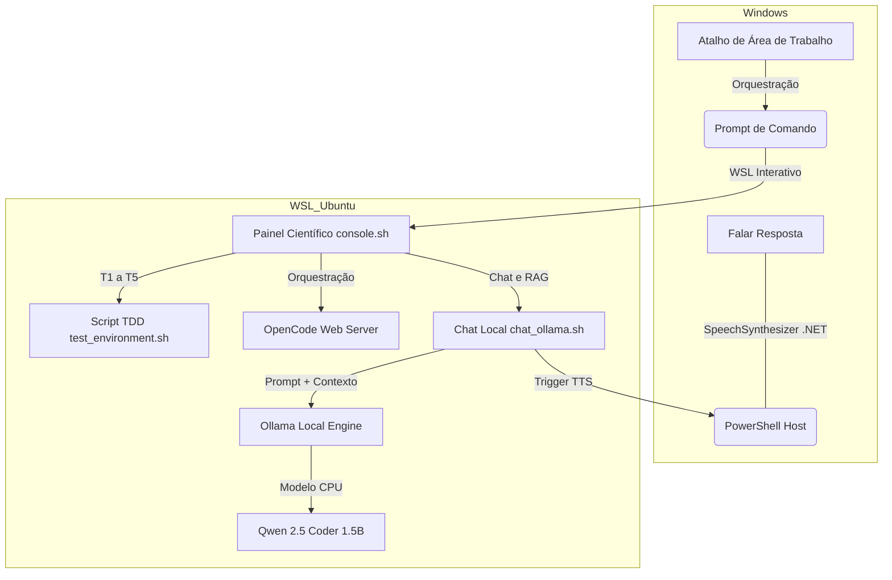

# manual_academic_presentation.md

---

# Apresentação e Manual Científico: Ecossistema OpenCode, Ollama & Antigravity

**Autor e Criador Principal:** Prof. Marcelo Claro Laranjeira  
**GitHub do Criador:** [https://github.com/MarceloClaro](https://github.com/MarceloClaro)  
**Registro ORCID:** [https://orcid.org/0000-0001-8996-2887](https://orcid.org/0000-0001-8996-2887)  
**Projeto de Repositório:** [OpenCode_Ecosystem](https://github.com/MarceloClaro/OpenCode_Ecosystem)  

---

````carousel
# SLIDE 1: Abertura Científica
## Ecossistema Unificado OpenCode, Ollama & Antigravity
### Uma abordagem orquestrada e auditável via WSL (Ubuntu)

* **Propósito:** Desenvolvimento de código assistido por IA com alto rigor metodológico.
* **Auditabilidade:** Testes TDD integrados garantindo conformidade científica.
* **Reprodutibilidade:** Automação completa para replicação em múltiplas estações científicas.
* **Autores:** 
  * Prof. Marcelo Claro Laranjeira ([ORCID: 0000-0001-8996-2887](https://orcid.org/0000-0001-8996-2887))

> [!NOTE]
> Este projeto representa uma ponte metodológica entre a IA Generativa de Código (Agentic Coding) e a reprodutibilidade empírica exigida por periódicos de alto impacto (Qualis A1).

<!-- slide -->
# SLIDE 2: Problema & Relevância Científica
## O Desafio da Reprodutibilidade em Ambientes Heterogêneos

* **Fragmentação:** Desenvolvedores enfrentam conflitos entre arquiteturas Windows nativas e ferramentas Linux de Data Science.
* **Inteligência Local e Privacidade:** Garantia de execução off-line total sem vazamento de dados de pesquisa.
* **Vocalização Inclusiva:** Retorno sonoro (TTS) nativo do Windows integrado ao terminal WSL para acessibilidade e melhoria da experiência de desenvolvimento.



<!-- slide -->
# SLIDE 3: Abordagem Metodológica (Qualis A1)
## SDD (Design de Software) e TDD (Test-Driven Development)

1. **Validação Estrita (TDD):** Antes de iniciar qualquer agente de IA, a estação de trabalho passa por uma bateria de testes que valida o sistema operacional, usuário do sistema, permissões de escrita em disco NTFS/drvfs e integridade das ferramentas.
2. **Motor Local (Ollama):** Uso do modelo `qwen2.5-coder:1.5b` (~986MB) para garantir latência ultrabaixa e alto rendimento de inferência executada puramente em CPU.
3. **RAG Híbrido (Retrieval-Augmented Generation):**
   * **Interno:** Pesquisa local no código fonte via `grep` de arquivos em `/projects`.
   * **Externo:** Acesso à API da Wikipedia em Português para consulta dinâmica de conceitos científicos e acadêmicos.

| Caso de Teste | Especificação | Rigor Científico |
| :--- | :--- | :--- |
| **T1: WSL Running** | `grep "microsoft" /proc/version` | Garante a camada de compatibilidade Linux |
| **T2: User Audit** | `whoami == marcelo` | Rastreabilidade do usuário acadêmico |
| **T3: Path Check** | `which opencode` | Garante disponibilidade de compilação/execução |
| **T4: Executable Test** | `opencode --version` | Validação dinâmica do binário de IA |
| **T5: Disk Permissions** | `touch && rm` | Confirma escrita bidirecional entre Windows/Linux |

<!-- slide -->
# SLIDE 4: Arquitetura do Sistema
## Orquestração das Interfaces de Agente

* **OpenCode Server:** Roda em background no WSL e atende a interface Web do Windows na porta fixa `4096`.
* **Antigravity CLI (`agy.exe`):** O agente avançado interage diretamente no terminal, compartilhando o mesmo espaço de arquivos `/mnt/c/Users/marce/Documents/OpenCode_Ecosystem`.
* **Chat Científico Local com TTS:** Interface interativa integrada que pesquisa localmente e na web, passa as referências ao Ollama, e vocaliza as conclusões usando a voz nativa do Windows de forma assíncrona.

```
+-------------------------------------------------------------+
|               PAINEL DE CONTROLE CIENTÍFICO                 |
|            (Interação e Auditoria em Tempo Real)            |
+-------------------------------------------------------------+
                              |
       +----------------------+----------------------+
       |                                             |
[OpenCode Web]                                [Antigravity CLI]
- Servidor local WSL                          - Agente Cognitivo
- Porta fixa 4096                             - Prompt Interativo (`agy -i`)
- Acesso Web no Windows                       - Continuação de Sessão (`agy -c`)
```
````

---

# Manual de Instalação e Operação

Este manual descreve a instalação passo a passo, a arquitetura e as funções de controle do ecossistema.

## 1. Primeira Instalação e Configuração

### Passo 1: Preparação do Ambiente WSL (Ubuntu)
Garanta que o WSL está instalado no Windows e que o usuário `marcelo` está configurado.

No PowerShell do Windows:
```powershell
# Verificar distribuições ativas
wsl -l -v
```

### Passo 2: Clonagem do Repositório do Ecossistema
Clone o repositório na pasta de documentos do seu usuário Windows:
```bash
cd /mnt/c/Users/marce/Documents
git clone https://github.com/MarceloClaro/OpenCode_Ecosystem.git
cd OpenCode_Ecosystem
```

### Passo 3: Executar a Instalação Automatizada do OpenCode
Dentro do terminal do WSL, execute o script de instalação para baixar e configurar o OpenCode automaticamente:
```bash
bash scripts/install_ecosystem.sh
```
*O instalador irá baixar a versão estável, mover para `~/.opencode/bin/` e atualizar as variáveis de ambiente no seu `~/.bashrc`.*

### Passo 4: Instalar e Configurar o Ollama no WSL
O Ollama gerencia os modelos locais rodando diretamente em CPU de forma leve. A instalação é feita de forma automatizada pelo script de instalação principal ou manualmente no terminal do WSL:
```bash
# 1. Instalar ferramenta de descompressão zstd
sudo apt-get install -y zstd

# 2. Baixar e instalar Ollama
curl -fsSL https://ollama.com/install.sh | sh
```

### Passo 5: Baixar o Modelo Otimizado para CPU
Para garantir a melhor eficiência e eficácia, baixamos o modelo `qwen2.5-coder:1.5b`:
```bash
ollama pull qwen2.5-coder:1.5b
```

---

## 2. Funções e Comandos do Painel do Ecossistema

O **Painel de Controle** (`scripts/console.sh`) reúne e orquestra todas as funções do ambiente. Ele pode ser executado diretamente pelo atalho na Área de Trabalho do Windows (**Painel_Ecosistema**) ou no WSL com o comando:
```bash
bash scripts/console.sh
```

### Detalhamento das Funções do Menu:

### `[1] Iniciar Servidor OpenCode Web`
- **Comando interno:** `opencode web --hostname 127.0.0.1 --port 4096`
- **Função:** Inicia o servidor local do OpenCode, focado na pasta de projetos, e abre o navegador Windows padrão em `http://localhost:4096`.
- **Rigor:** Impede conflitos de portas e garante que os projetos fiquem isolados.

### `[2] Executar Auditoria TDD Completa`
- **Comando interno:** `bash tests/test_environment.sh`
- **Função:** Roda a bateria de testes automatizados e retorna um relatório visual em português (GREEN se tudo estiver certo, RED se houver erros).
- **Rigor:** Essencial para garantir a validade dos experimentos científicos antes da execução do código.

### `[3] Sincronizar com GitHub (Git Push)`
- **Comando interno:** `git add . && git commit -m "<msg>" && git push -u origin main`
- **Função:** Salva o estado dos projetos e documentação e envia um backup incremental ao GitHub de forma rápida e segura.
- **Rigor:** Salva os logs científicos e códigos no repositório.

### `[4] Abrir Pasta de Projetos no Windows Explorer`
- **Comando interno:** `explorer.exe`
- **Função:** Abre a pasta física do projeto no explorador de arquivos do Windows para facilitar o gerenciamento de arquivos visuais e códigos.

### `[5] Visualizar Documento de Design (SDD)`
- **Comando interno:** `cat docs/sdd.md`
- **Função:** Permite a leitura rápida das diretrizes de design de arquitetura e validação científica do ecossistema.

### `[6] Continuar Conversa no Antigravity CLI (agy.exe -c)`
- **Comando interno:** `agy.exe -c`
- **Função:** Retoma a última sessão ativa com o agente de programação Antigravity, no contexto da pasta atual de desenvolvimento.

### `[7] Novo Prompt Interativo no Antigravity CLI (agy.exe -i)`
- **Comando interno:** `agy.exe -i --prompt "<texto>"`
- **Função:** Permite iniciar uma nova tarefa de programação interativa enviando uma instrução inicial em português.

### `[8] Listar Modelos Disponíveis no Antigravity (agy.exe models)`
- **Comando interno:** `agy.exe models`
- **Função:** Exibe os modelos de Inteligência Artificial configurados e prontos para serem usados pelo agente de código.

### `[9] Chat Local + Busca + Vocalização (Ollama + Qwen 1.5B)`
- **Comando interno:** `bash scripts/chat_ollama.sh`
- **Função:** Abre o chat acadêmico local. O sistema solicita sua pergunta e a opção de enriquecimento por busca (interna/externa/híbrida). O modelo local Qwen interpreta o resultado com base no contexto, escreve na tela a resposta científica e a vocaliza em português usando o assistente de voz do Windows em background.

---

> [!TIP]
> **Autenticação de Git Facilitada:** O sistema foi configurado para reter suas credenciais de acesso ao GitHub após a primeira digitação. Isso permite backups instantâneos e auditoria reprodutível sem barreiras de autenticação a cada commit.
