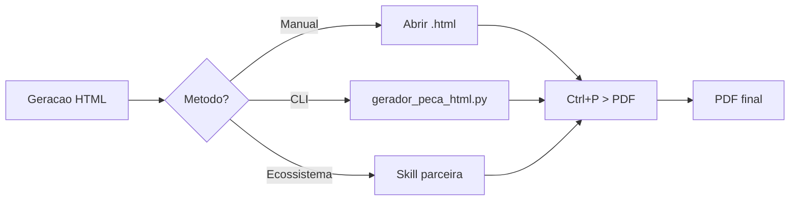

# Ferramentas de Exportacao v2.0

Metodos disponiveis para exportar pecas juridicas HTML para PDF.

## Metodo 1 — Manual (Ctrl+P)

Recomendado para geracoes unicas ou revisao visual.

```
1. Abrir o arquivo .html no Chrome/Edge
2. Ctrl+P (ou Cmd+P no macOS)
3. Destino: "Salvar como PDF"
4. Opcoes:
   - Margens: Padrao
   - Graficos de fundo: ATIVADO
   - Escala: 100%
5. Salvar
```

## Metodo 2 — CLI Integrado

Usar `scripts/gerador_peca_html.py` com flag `--output`:

```powershell
python scripts/gerador_peca_html.py --tipo pi --output ./minha_peca.html
```

Geracao com dados JSON inline:

```powershell
python scripts/gerador_peca_html.py --tipo pi --dados "{\"autor\": \"Joao\"}" --output ./peca.html
```

Geracao com arquivo JSON:

```powershell
python scripts/gerador_peca_html.py --tipo ct --arquivo-dados dados.json --output ./contestacao.html
```

### Opcoes do CLI

| Flag | Descricao | Padrao |
|------|-----------|--------|
| `--tipo` | Tipo de peca (pi, ct, rp, ai, ap, ed, cr, pr) | Obrigatorio |
| `--dados` | JSON com dados para placeholders | `{}` |
| `--arquivo-dados` | Arquivo JSON com dados | `null` |
| `--output` | Caminho do arquivo de saida | `./output.html` |
| `--placeholder` | Listar placeholders do tipo e sair | `false` |
| `--list` | Listar tipos disponiveis e sair | `false` |
| `--abrir` | Abrir navegador apos geracao | `false` |

## Metodo 3 — Integracao com Skills do Ecossistema

### Triagem Juridica (`triagem-juridica`)

A triagem pode sugerir o tipo de peca e coletar dados processuais basicos, que sao passados ao CLI como `--dados`.

### Pesquisa Jurisprudencia (`pesquisa-jurisprudencia`)

A pesquisa de jurisprudencia pode fornecer ementas e julgados que alimentam a secao "Do Direito" da peca.

### Segunda Opiniao (`agent-forum`)

O forum multiagente pode revisar a peca gerada antes da exportacao final.

## Fluxo de Exportacao Completo



## Exemplo de Dados JSON

```json
{
  "autor": "Joao da Silva",
  "nacionalidade": "brasileiro",
  "estado_civil": "casado",
  "profissao": "comerciante",
  "cpf": "000.000.000-00",
  "email": "joao@email.com",
  "endereco": "Rua A, 100, Centro, Sao Paulo - SP",
  "narrativa_fatos": "Texto dos fatos...",
  "fundamentacao_juridica": "Texto do direito...",
  "valor_causa": "R$ 10.000,00",
  "cidade": "Sao Paulo",
  "data": "05 de junho de 2026",
  "nome_advogado": "Dr. Marcio Advogado",
  "oab": "OAB/SP 123.456"
}
```

---
