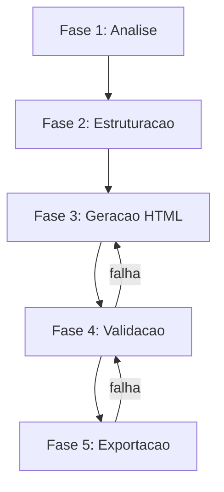

# Protocolo de Geracao v2.0

Fluxo padrao para geracao de pecas juridicas HTML no ecossistema OpenCode.

## Visao Geral



## Fase 1 — Analise e Coleta

| Atividade | Descricao | Input | Output |
|-----------|-----------|-------|--------|
| 1.1 Identificar tipo | Classificar a peca entre os 8 tipos suportados | Descricao do usuario | `tipo_peca` |
| 1.2 Coletar dados processuais | Numero do processo, partes, vara, juizo | Dados do usuario | Metadados |
| 1.3 Coletar fundamentacao | Legislacao, jurisprudencia, doutrina | Material do usuario | Conteudo juridico |
| 1.4 Verificar placeholders | Mapear `{{ var }}` no template do tipo | Template base | Lista de vars |

### Tipos Suportados

| Tipo | Sigla | Descricao |
|------|-------|-----------|
| Peticao Inicial | PI | Primeira manifestacao ao juizo |
| Contestacao | CT | Defesa do reu |
| Replica | RP | Manifestacao apos contestacao |
| Agravo de Instrumento | AI | Recurso contra decisao interlocutoria |
| Apelacao | AP | Recurso contra sentenca |
| Embargos de Declaracao | ED | Esclarecimento de obscuridade/contradicao |
| Contrarrazoes | CR | Manifestacao contra recurso |
| Parecer | PR | Opiniao tecnico-juridica |

## Fase 2 — Estruturacao e Planejamento

1. Selecionar template do tipo em `TIPOS_PECA` (gerador_peca_html.py)
2. Mapear secoes obrigatorias do tipo (vide `formatos-peca.md`)
3. Estimar risco de supressao por contexto:
   - Se conteudo > 80% do limite do modelo, informar usuario
   - Sugerir geracao por blocos (fundamentacao separada)
4. Planejar divisao por secoes com `page-break` onde necessario

## Fase 3 — Geracao do HTML

### 3.1 Template Engine

Usar o CLI integrado (`scripts/gerador_peca_html.py`) ou geracao manual.

Estrutura minima obrigatoria:
```html
<!DOCTYPE html>
<html lang="pt-BR">
<head>
  <meta charset="UTF-8">
  <style>/* CSS obrigatorio */</style>
</head>
<body>
  <div class="doc">
    <!-- conteudo -->
  </div>
</body>
</html>
```

### 3.2 Regras de Estilo Obrigatorias

- Fonte titulos: Space Grotesk (Google Fonts)
- Fonte corpo: DM Sans (Google Fonts)
- Tamanho corpo: 15px, citacoes: 12.5px
- Espacamento: 1.65, recuo primeira linha: 2cm
- Margens: `@page { margin: 20mm 20mm 20mm 32mm; }`
- Faixa lateral: `border-left: 6px solid #B08A4E` no `.doc`

### 3.3 Regras Criticas de Impressao

- **PROIBIDO** `height`, `min-height`, `max-height` em containers
- **PROIBIDO** `position: fixed/absolute` para elementos de fluxo
- **OBRIGATORIO** `break-inside: avoid` em elementos atomicos
- **OBRIGATORIO** `orphans: 3; widows: 3` em paragrafos
- **OBRIGATORIO** Logo SVG inline (nunca arquivo externo)

## Fase 4 — Validacao e Revisao

| Item | Criterio | Acao se falha |
|------|----------|---------------|
| 4.1 Placeholders | Nenhum `{{ }}` nao preenchido | Substituir ou informar usuario |
| 4.2 Estrutura | Todas as secoes obrigatorias presentes | Adicionar secoes faltantes |
| 4.3 CSS | Regras de impressao aplicadas | Corrigir CSS |
| 4.4 Conteudo | Nenhum texto generico de exemplo | Substituir por conteudo real |
| 4.5 Logo | SVG inline, visivel, sem quebra | Corrigir SVG |
| 4.6 Processo | Numero do processo presente | Adicionar cabecalho |

## Fase 5 — Exportacao e Entrega

1. Salvar como `.html` no diretorio de output
2. Informar usuario: `Ctrl+P > Salvar como PDF > Margens: Padrao > Graficos de fundo: ativado`
3. Alternativa: usar `--output` do CLI para exportacao automatizada

---
